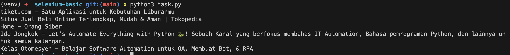

# Selenium Basic

This is a first task of automation class by kelas automesyen. The language of this task is Python.

## Tech Stack

- Python version 3.13.2
- Selenium version 4.31.0
- ChromeDriver 135.0.7049.114

## Operation System

- Mac OS Sanoma 14.5

## Installation

- Virtual environment

  `python3 -m venv venv`

- Activate virtual environment

  `source venv/bin/activate`

- Install requirements

  `pip install selenium`

## Output

